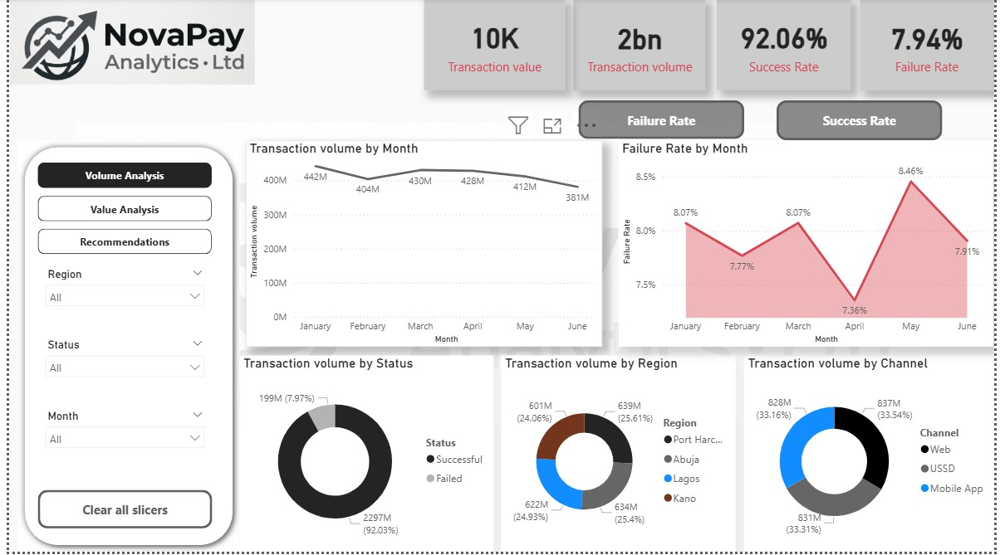

# novapaydashboard
The goal is to recommend optimizations that improve transaction success rates, enhance user experience, balance regional growth, and mitigate operational risks.

# Problem Statement
Analyze the provided transaction dataset (10,000 records from January 1 to June 28, 2024) to evaluate key performance indicators (KPIs), identify trends in volume and value, assess performance by channel, region, and transaction type, quantify success/failure rates, and deliver actionable insights.
The goal is to recommend optimizations that improve transaction success rates, enhance user experience, balance regional growth, and mitigate operational risks. Present findings in a clear, professional format suitable for Product, Operations, and Risk stakeholders.

# Objectives
•Calculate core KPIs (total volume, success rates, average transaction value).
•Identify temporal trends and patterns.
•Compare performance across transaction types, channels, and regions.
•Highlight failure hotspots and improvement opportunities.
•Provide 3–5 prioritized business recommendations.

Deliverables Expected Executive summary, detailed EDA, visualizations with clear interpretations, and prioritized recommendations.

## VISUALIZATION
 
